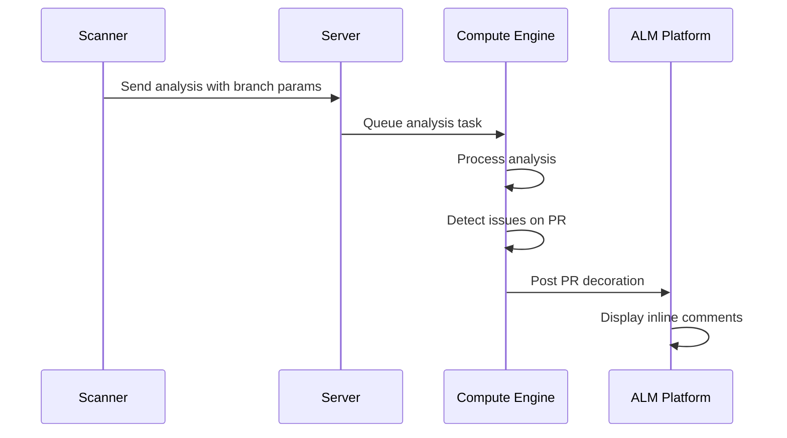

## Overview

The SonarQube Community Branch Plugin uses a sophisticated architecture based on **Java agent bytecode manipulation** to enable branch and pull request analysis in SonarQube Community Edition. The plugin intercepts and modifies SonarQube's internal classes at runtime to unlock features normally restricted to commercial editions.

## Core Components

The plugin consists of three main components that operate across different parts of the SonarQube ecosystem:

<CardGroup cols={3}>
  <Card title="Scanner" icon="magnifying-glass">
    Runs during code analysis to detect branches and pull requests
  </Card>
  <Card title="Compute Engine" icon="gears">
    Processes analysis results and decorates pull requests
  </Card>
  <Card title="Server" icon="server">
    Provides web UI enhancements and API endpoints
  </Card>
</CardGroup>

## Java Agent Architecture

### Bytecode Manipulation

The plugin operates as a **Java agent** using the `java.lang.instrument` API. This allows it to transform classes as they're loaded by the JVM.

<Info>
  The Java agent is configured via the `Premain-Class` manifest attribute pointing to `CommunityBranchAgent`.
</Info>

**Key mechanism** (from `CommunityBranchAgent.java:40-135`):

```java
public static void premain(String args, Instrumentation instrumentation) {
    Component component = Component.fromString(args); // Either "ce" or "web"
    
    if (component == Component.CE) {
        // Modify Compute Engine classes
        redefineEdition(instrumentation, 
            "com.github.mc1arke.sonarqube.plugin.CommunityBranchPluginBootstrap",
            redefineIsAvailableFlag());
        redefineEdition(instrumentation,
            "org.sonar.core.platform.PlatformEditionProvider",
            redefineOptionalEditionGetMethod());
    } else if (component == Component.WEB) {
        // Modify Web Server classes
        redefineEdition(instrumentation,
            "org.sonar.server.newcodeperiod.ws.SetAction",
            redefineConstructorEditionProviderField(Edition.DEVELOPER));
    }
}
```

### Runtime Class Transformation

The agent uses **Javassist** to manipulate bytecode:

1. **Edition spoofing** - Makes SonarQube think it's running Developer Edition
2. **Feature flag modification** - Enables branch features by rewriting `isAvailable()` methods
3. **Constructor injection** - Modifies constructors to inject custom edition providers

Example transformation:

```java
private static Redefiner redefineOptionalEditionGetMethod() {
    return ctClass -> {
        CtMethod ctMethod = ctClass.getDeclaredMethod("get");
        ctMethod.setBody(
            "return java.util.Optional.of(org.sonar.core.platform.EditionProvider.Edition.DEVELOPER);"
        );
    };
}
```

## Component Details

### 1. Scanner Component

**Purpose**: Detects and configures branch/PR analysis during code scanning

**Location**: Runs on the scanner side (developer machine or CI/CD)

**Key classes** (from `CommunityBranchPlugin.java:163-171`):

- `CommunityProjectBranchesLoader` - Loads existing branches from server
- `CommunityBranchConfigurationLoader` - Creates branch configuration
- `CommunityBranchParamsValidator` - Validates branch parameters
- `BranchConfigurationFactory` - Factory for creating branch configurations
- `ScannerPullRequestPropertySensor` - Detects PR properties

**Auto-configuration support**:

- GitHub Actions
- GitLab CI
- Azure DevOps
- Bitbucket Pipelines
- Jenkins
- Cirrus CI
- CodeMagic

**Branch detection** (from `BranchConfigurationFactory.java:33-46`):

```java
public BranchConfiguration createBranchConfiguration(String branchName, ProjectBranches branches) {
    if (branches.isEmpty()) {
        return new CommunityBranchConfiguration(branchName, BranchType.BRANCH, null, null, null);
    }
    String targetBranchName = branches.get(branchName) == null 
        ? branches.defaultBranchName() 
        : branchName;
    return new CommunityBranchConfiguration(branchName, BranchType.BRANCH, targetBranchName, null, null);
}
```

### 2. Compute Engine Component

**Purpose**: Processes analysis results and decorates pull requests on ALM platforms

**Location**: Runs in the SonarQube Compute Engine (background task processor)

**Activation**: Via javaagent parameter:
```properties
sonar.ce.javaAdditionalOpts=-javaagent:./extensions/plugins/sonarqube-community-branch-plugin-{version}.jar=ce
```

**Provided components** (from `CommunityReportAnalysisComponentProvider.java:48-57`):

- `CommunityBranchLoaderDelegate` - Loads branch data
- `PullRequestPostAnalysisTask` - Post-analysis task for PR decoration
- `PostAnalysisIssueVisitor` - Visits and collects issues for reporting
- `PullRequestFixedIssuesIssueVisitor` - Tracks fixed issues
- `ReportGenerator` - Generates analysis reports
- `MarkdownFormatterFactory` - Formats PR comments in Markdown

**Pull request decorators**:

- `GithubPullRequestDecorator` - GitHub PR comments
- `GitlabMergeRequestDecorator` - GitLab MR comments
- `BitbucketPullRequestDecorator` - Bitbucket PR comments
- `AzureDevOpsPullRequestDecorator` - Azure DevOps PR comments

**Client factories**:

- `GithubClientFactory` - GitHub API client
- `DefaultGitlabClientFactory` - GitLab API client
- `DefaultBitbucketClientFactory` - Bitbucket API client
- `DefaultAzureDevopsClientFactory` - Azure DevOps API client

### 3. Server Component

**Purpose**: Provides web UI enhancements and REST API endpoints

**Location**: Runs in the SonarQube web server process

**Activation**: Via javaagent parameter:
```properties
sonar.web.javaAdditionalOpts=-javaagent:./extensions/plugins/sonarqube-community-branch-plugin-{version}.jar=web
```

**Core extensions** (from `CommunityBranchPlugin.java:82-142`):

- `CommunityBranchFeatureExtension` - Enables branch features in UI
- `CommunityBranchSupportDelegate` - Branch support delegation
- `MonoRepoFeature` - Mono-repository support

**Web services**:

- `PullRequestWs` - Pull request REST API
- `SupportWs` - Support information API
- `DeleteAction`, `ListAction` - PR management actions

**ALM binding actions**:

- `SetGithubBindingAction`
- `SetGitlabBindingAction`
- `SetBitbucketBindingAction`
- `SetAzureBindingAction`
- `ValidateBindingAction`
- `DeleteBindingAction`

**Validators**:

- `GithubValidator`
- `GitlabValidator`
- `BitbucketValidator`
- `AzureDevopsValidator`

**Property definitions**:

- Branch purge configuration
- Inactive branch retention
- Image base URL for PR comments

## Plugin Lifecycle

### Initialization

1. **Bootstrap phase**: `CommunityBranchPluginBootstrap` loads and initializes the plugin
2. **Component registration**: Plugin registers components based on SonarQube side (Scanner/CE/Server)
3. **Java agent activation**: Agent modifies classes before they're used

### Analysis Flow



### Component Interaction

The plugin uses SonarQube's extension points:

- **Plugin interface**: For scanner-side extensions
- **CoreExtension interface**: For server/CE extensions
- **ReportAnalysisComponentProvider**: For CE component injection

## Frontend Modifications

The plugin includes a modified SonarQube web frontend distributed as `sonarqube-webapp.zip`:

- Branch dropdown in project overview
- Pull request list view
- Branch comparison UI
- New Code Period settings for branches

These modifications are built from the `sonarqube-webapp` submodule with custom additions from `sonarqube-webapp-addons`.

## Security Considerations

<Warning>
  The plugin uses bytecode manipulation to bypass edition restrictions. This is an unsupported modification of SonarQube's internals.
</Warning>

- **No official support**: SonarSource does not support this plugin
- **Upgrade risks**: May break with SonarQube updates
- **Data migration**: No guaranteed path to commercial editions
- **Third-party warning**: SonarQube displays a warning about third-party plugins

## Key Technologies

- **Javassist**: Bytecode manipulation library
- **Java Instrumentation API**: For class transformation
- **OkHttp**: HTTP client for ALM communication
- **SonarQube Plugin API**: Extension framework
- **React/TypeScript**: Frontend modifications
